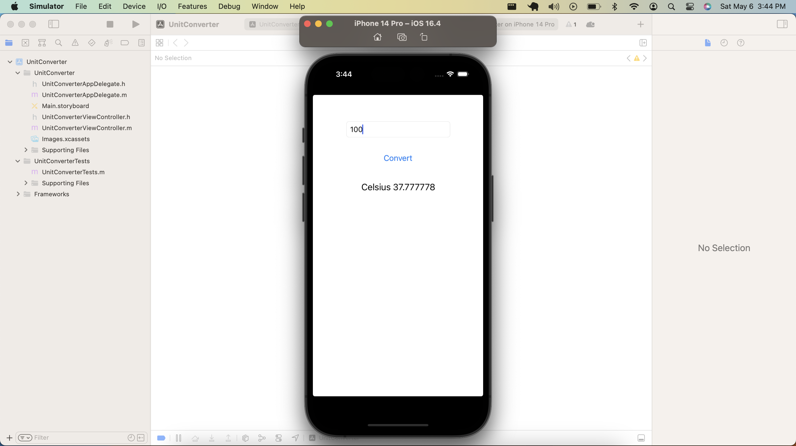
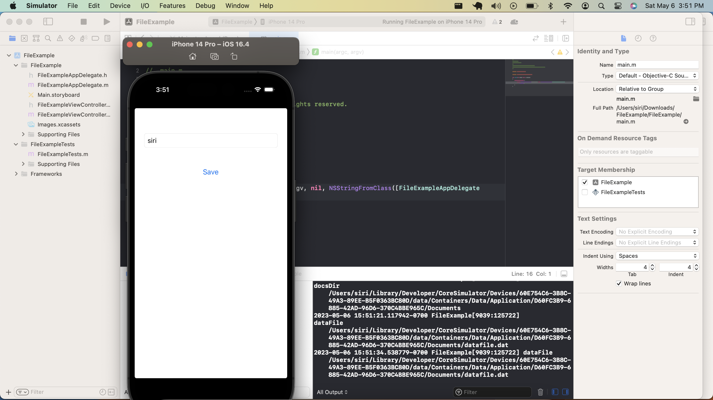

### cmpe277_Iosapp
### Course: Smartphone Application Development
### Student Name : Sirisha Polisetty

### Learning Objective:

The purpose of the assignment is to re-run the following iOS App (code provided) and capture the run outputs:
* Unit Converter
* File Example

### Unit converter Screen Capture

### FileExample Screen Capture

